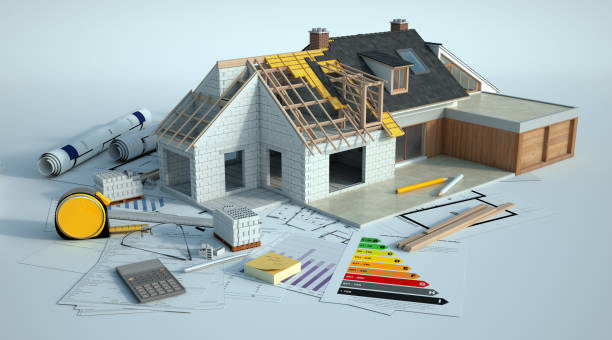
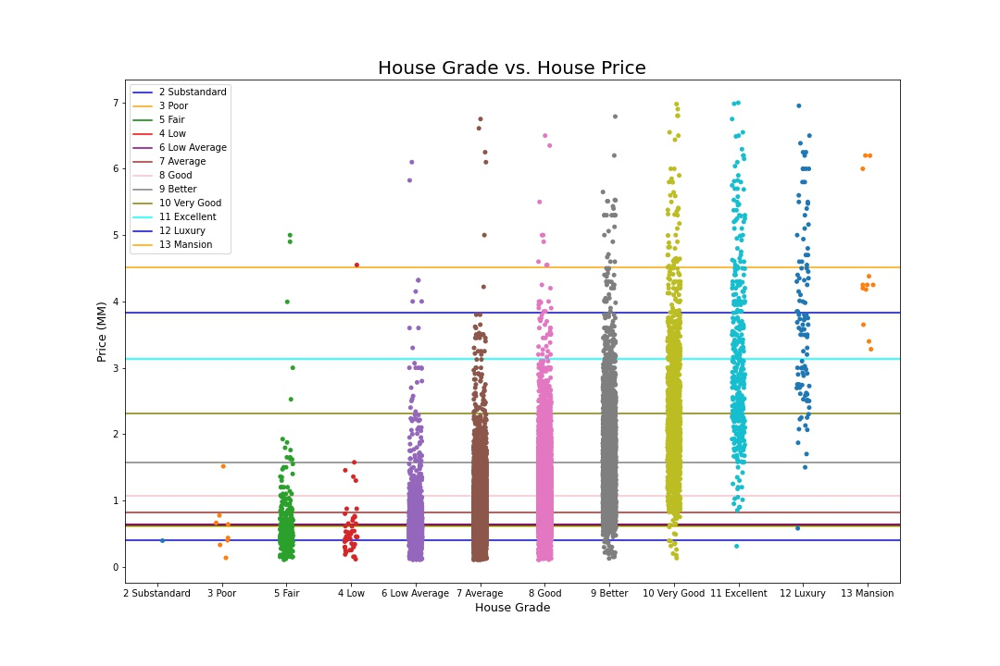
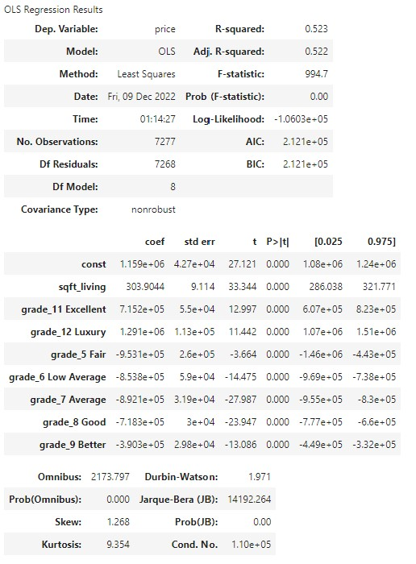
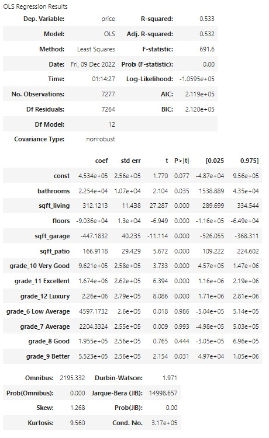
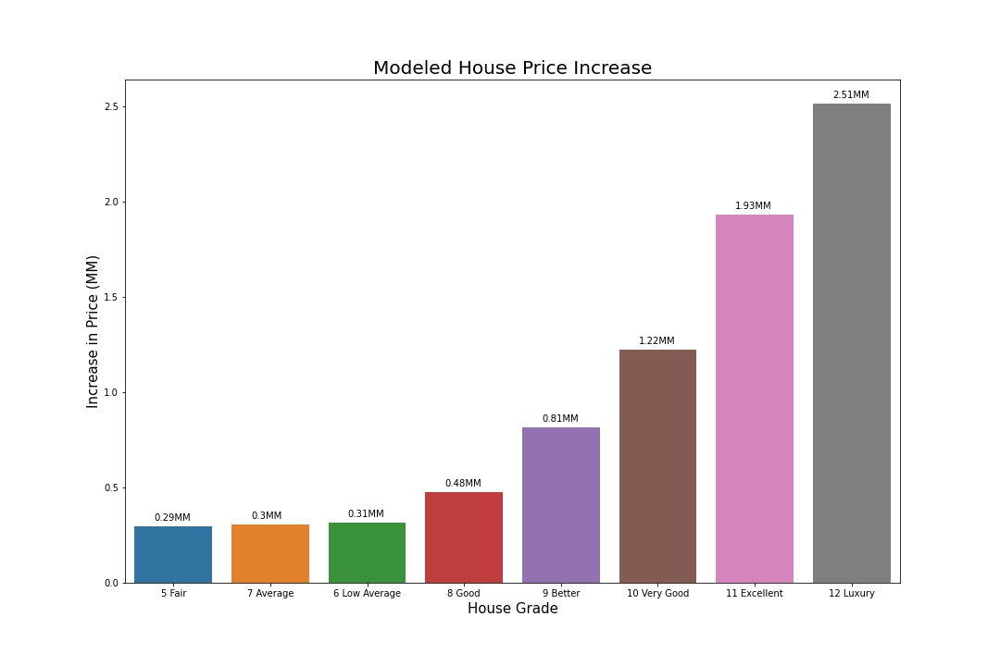

# King-County-Real-Estate-Analysis
# Renovation And House Price

Presented by Matthew Duncan, Leif Schultz, and Jasmine Huang

## Overview
We analyzed data from the King County, WA housing dataset to determine which house features renovations would add the most value to a house.

## Main Goals
We are advising a real estate agency tasked to help potential home sellers decide what renovations to make for increasing their home value.

- First priority is to find the most highly correlated numerical features that can be changed to increase home value.
- Second priority is to find what categorical features that can be changed to increase home value.
- Third priority is to correct models assumptions.

## The Data
King County House Sales dataset: kc_house_data.csv

Our original dataset had 25 features describing 30,155 rows of housing sets. There were 46 rows with null data that were dropped during the cleaning process, leaving us with 30,111 rows of housing set data to use for our model.

Of the 25 features, dtypes included: 10 object, 10 int, and 5 float. We further explain and reduce the features below.

### Initial Baseline Model

#### Correlation
We set 'price' as the target variable for our model.  The predictor variable with the highest correlation was `sqft_living` with a correlation of 0.608.

To get an initial understanding of our data, we built a baseline simple linear regression model utilizing the feature `sqft_living` since it has the highest correlation to our target feature: price.

### Initial Data Cleaning

We modeled the target and predictor data to check its shape and to determine whether there were outliers that could be affecting our data. It was decided to remove any values below the .3 percentile and above the 99.7 percentile for the following features:

- `price`
- `bedrooms`
- `sqft_living`
- `sqft_above`
- `sqft_patio`
- `sqft_garage`
- `sqft_basement`

To ensure that we stayed relevant to the question asked of us, the columns below were removed for a variety of reasons:
- Drop ID: Just a unique identifier, no helpful information.
- Drop address and lat/long: Location not important in this analysis.
- Drop year renovated and year built: Not relevant for remodeling purposes.
- Drop date: Last sale date is not relevant to remodeling home.
- Drop sq_ft lot: Cannot change lot size by remodeling home.
- Waterfront: Cannot change the house location to be moved next to water.
- Greenbelt: Cannot change the house location to be moved next to a greenbelt.
- View: Cannot change the house location to have a good view.
- Sewer System: Not likely to change your entire sewer system during a home remodel.

### Second Simple Linear Regression Model (After Dropping Outliers in Sale Price)
We needed to run a second simple linear regression model after dropping our outliers to ensure that the model improved after making the changes. To compare the linear models against the simple correlation table run above, we use the function: `simple_num_model_all_combos`, found in the included .py file. This function runs a simple linear regression model on all predictor features in a dataframe against the specified target feature.

Now that the outliers in price have been dropped, our simple linear regression model has an R-squared value of .42, increased from the baseline results of .37.

### Baseline Multi-Linear Regression Model
Now that our data has been cleaned, we have our improved simple linear regression model, and we have dropped features that are highly correlated in an attempt to reduce multicollinearity, we can check our results using multi-linear regression. 

To compare the multi-linear regression models and find the absolute best fit, we use the function, `multi_num_model_all_combos`, found in the included .py file. This function runs a multi-linear regression model for all combinations of predictor features in a given dataframe against the specified target feature. 

We found that the combination of 6 of the remaining predictor variables has the third highest adjusted R-squared value (.441) and all coefficient p-values are statistically significant. We will be using these variables from now on as we move forward.

We did not choose the absolute highest adjusted R-squared value because not all p-values are statistically significant in the model and they have nearly identical adjusted R-squared values.

#### Results of model:
- Our model explains about 44.1% of the variance in our data
- Our models F-statistic is statatistically significant compared to our alpha of 0.05
- All coefficient are statistically significant when compared to our alpha of .05

#### Interpretations:
- For a house with no `bedrooms`, `bathrooms`, `sqft_living`, `sqft_basement`, `sqft_garage`, or `sqft_patio` we would expect the house to be valued about \$150,000
- For each additional bedroom and all other features remaining zero, we would expect the home to lose value of about \$83,000
- For each additional 1 square foot in living space size and all other features remaining zero, we would expect the house to gain about \$560
- For each additional 1 square foot in basement size and all other features remaining zero, we would expect the house to lose about \$57
- For each additional 1 square foot in garage size and all other features remaining zero, we would expect the house to lose about \$335
- For each additional 1 square foot in patio size and all other features remaining zero, we would expect the house to gain about \$290

#### Checking Partial Regression Plots for our Model
Now we can check partial regression plots for our model. The goal is to show the marginal contribution of each particular predictor. These models correlate 
with the slope of the coefficient in our standardized model. Those with a higher value for the absolute value of the slope have a larger impact on our modeling.

We can see that each plot shows a linear relationship with a non-zero slope meaning that it is beneficial to add each of these features to the model.

#### Categorical Data
Now that we have our categorical data in place, we can begin running models on each of the categorical datasets. To better compare each run, we use the function: `base_check_for_category`, found in the included .py file. This function runs a one-hot encoded multi-linear regression for the specified categorical feature in conjunction with the highest correlated numerical feature `sqft_living`.

###### Grade: Correlation and Model Result

### Now running categories along with multilinear regression

## Results
- Our final model explains about 53.1% of the variance in the data overall.
- Our model is statistically significant when compareed to our alpha = 0.05.
- P-values for `sqft_living`, `sqft_basement`, `sqft_garage`, and `sqft_patio` are statistically significant.
- p-values for 3 of the 7 grades are statistically significant.
- The MAE for our final model indicates potential variance of about $354,000 dollars

### Interpretation
**Importance:**
- When looking at the standardized model, we see that `sqft_living` has the highest coefficient.
    - This means that increasing square foot living area will have the most drastic change to house price and should be prioritized during renovation.
This means that they will have the most drastic change to the model at scale and should be prioritized
when we look at our regular model we can get some good interpretation taking everything else into consideration

**Changes in Numerical Variables:**
- When we look at our non-standardized final model, we can get additional insight:
    - Given a 'Fair' quality house with everything else being zero, we would expect the house to be priced about \$294,000
        - For every 100 sq ft increase in living area, we would expect the house value to increase by about \$29,000
        
**Changes in Categorical Variables:**
- We see statistically significant coefficients for building grade and when compared to a house with a grade of Fair:
    - 'Very Good' quality improvements would increase home value by about \$930,000
    - 'Excellent' quality improvements would increase home value by about \$1,640,000
    - 'Luxury' quality improvements would increase home value by about \$2,220,000
    
    

### Recommendations
- We recommend increasing the living area square footage of a home as the greatest impact to the renovation.

- We recommend spending the extra dollars during renovation for quality craftsmanship. Increasing the grade of a home is shown to pay off in the long run with vastly greater home values than homes with lower grades.

## Next steps
- Our data was only for homes sold between June of 2021 and June of 2022, given the state of the realty market during this post-pandemic time, its not surprising that there was a lot of unexplained variance in the model. 
    - With more data from years prior to the pandemic, we believe that would could find a more highly correlated model
- Given the timeframe for this report, we were not able to look at features that were not able to be renovated.
    - With more time, we could model additional features to get a better understanding of their impact on variance
